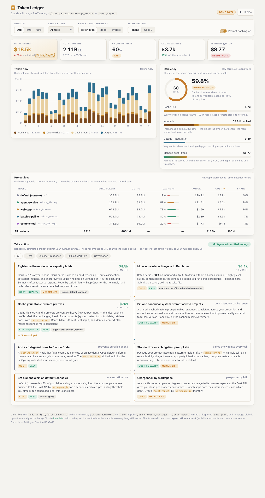

# 🪙 Token Ledger

A self-hosted dashboard for your **Claude API** usage — tokens, cost, per-project
breakdown, and efficiency recommendations that tell you *what to actually do* to
spend less without hurting quality.

It runs against the [Anthropic Usage & Cost Admin API](https://platform.claude.com/docs/en/api/usage-cost-api).
No account? No key? It still works — it ships with a realistic sample so you can
see the whole thing before wiring up your own data.



---

## Your data stays yours

This is the important part, so it's first:

- The **tool** is public — clone it, read it, fork it.
- Your **usage numbers are not.** When you fetch your real data, it lands in
  `data.json`, which is **gitignored**. Your `.env` (holding your key) is
  gitignored too. Neither can be committed or pushed. They live only on your
  machine.

Nothing about your account, spend, or projects leaves your computer.

---

## Quick start

```bash
git clone <your-fork-url> token-ledger
cd token-ledger

# See it immediately with sample data — no key needed:
npm start
# → opens a server at http://localhost:4319
```

That's it. `npm start` fetches data (sample by default), serves the page, and
you open the URL. The badge in the corner reads **Demo data** until you add a key.

---

## Going live with your own usage

The dashboard reads a `data.json` produced by `scripts/fetch-usage.mjs`. To fill
it with *your* numbers:

### 1. You need an Admin key — which needs an organization

The Usage & Cost API requires an **Admin key** (`sk-ant-admin01-…`), which is
different from a normal API key and is **only available to organization
accounts.**

If you're on an individual account, create an org first — it's free and doesn't
change your billing:

> **Claude Console → Settings → Organization**

Then create the Admin key:

> **Console → Settings → Admin keys**

*(Claude Enterprise / claude.ai orgs use a separate Analytics API key instead —
see the [docs](https://platform.claude.com/docs/en/api/usage-cost-api#which-api-do-you-need).)*

### 2. Add the key

```bash
cp .env.example .env
# edit .env and paste your key into ANTHROPIC_ADMIN_KEY=
```

### 3. Fetch and view

```bash
npm run fetch     # pulls up to 90 days of your usage + cost
npm run serve     # → http://localhost:4319
```

The badge flips to **Live data** with the fetch timestamp. Re-run `npm run fetch`
whenever you want fresh numbers (data is available within ~5 min of an API call).

---

## What's in the dashboard

**Overall**
- **Usage value (list price)** — the authoritative figure from the Cost API: the
  list-price value of tokens consumed. The dashboard trusts this over a hardcoded
  price table (which can be wildly off if you use models/rates it doesn't know).

  > **Credit vs. invoice:** the Cost API reports usage *value* at published rates,
  > not necessarily what you were charged. On a **prepaid-credit** account this value
  > is drawn down from your credit balance; on committed-use/discounted plans your
  > invoice may be lower. The API has no endpoint for your credit balance — enter it
  > in the **Credit balance** field to get a **runway estimate** (days left at your
  > current burn rate).
- Total tokens (in/out), cache hit rate, cache savings, prod-vs-dev split
- A daily stacked trend chart — regroup by **token type**, **model**, **project**,
  or **environment**; flip between **tokens** and **cost**
- **Monthly budget** — set a target and the dashboard projects your run-rate against
  it (a "Budget pace" tile that goes amber/red) and draws a daily-budget line on the
  cost chart

**Efficiency levers** — the numbers that move cost without touching output quality:
- **Cache hit rate** (share of input served from cache at ~10% of the price)
- **Cache ROI** ($ saved per $ spent writing to cache)
- **Input mix** (fresh vs cached — fresh is billed at full rate)
- **Output ÷ input ratio** (flags context-heavy work that's prime for caching)
- **Blended cost per million tokens**

**Project level** — one row per Anthropic workspace, sortable, with inline cache-hit
bars so the worst offenders read at a glance.

**Take action** — a recommendation engine that reads *your* current numbers and only
surfaces the levers that apply, ranked by estimated dollar impact. Covers API cost
levers (caching, batch tier, model right-sizing), response-quality levers, Claude Code
skills/workflow, and governance (spend alerts, per-workspace chargeback).

The dollar figures are **estimates, not measurements** — each quantified card states
the assumption it leans on (e.g. "assumes 55% of fresh input can become cache reads"),
and an **Assumptions** panel in that section lets you tune every constant to match
your own workloads. Figures recompute instantly; your settings persist locally.

### Knobs

- **Window:** 30 / 60 / 90 days
- **Service tier:** all / standard / batch / priority
- **Group trend by:** token type / model / project
- **Value:** tokens or cost
- **Prompt caching on/off** — models the counterfactual: what you'd pay with no caching

---

## How it works

```
scripts/fetch-usage.mjs   ── calls the Admin API (chunked ≤31d/request),
                             normalizes to millions of tokens per
                             day × project × token-type, writes ↓
data.json                 ── your data (gitignored)
index.html                ── fetches ./data.json on load; falls back to
                             the built-in sample if absent
scripts/serve.mjs         ── tiny static server (browsers block file:// fetch)
sample.data.json          ── committed demo fixture (safe, synthetic)
```

Token-type fields from the API — `uncached_input_tokens`, `cache_read_input_tokens`,
`cache_creation_input_tokens`, `output_tokens` — map 1:1 onto the chart stacks and
every efficiency meter. The dashboard recomputes cost from tokens (using the prices in
`fetch-usage.mjs`) so the caching/tier toggles can show live counterfactuals; the
authoritative Cost API figure is also stored per project-day for reconciliation.

> **Pricing note:** per-model prices live in one place — `scripts/lib/pricing.mjs`,
> with per-version entries (Opus 4.1 is priced 3× Opus 4.8, old Haiku differs from
> new, etc.). Every fetch embeds the table into `data.json`, so the dashboard prices
> live data from the same numbers, and a reconcile canary warns on every fetch if
> they drift from your real bill. `index.html` keeps a small inline fallback for the
> offline demo — CI fails if it drifts from `pricing.mjs`.

---

## Keeping it current (optional)

Want `data.json` to refresh unattended? Add a cron / launchd entry that runs the
fetch on a cadence — once daily is plenty:

```bash
# crontab -e   — refresh every morning at 6am
0 6 * * * cd /path/to/token-ledger && /usr/bin/node scripts/fetch-usage.mjs >> fetch.log 2>&1
```

---

## Security notes

- The Admin key is read only from `.env`, never hardcoded, never logged.
- `.env`, `data.json`, and snapshots are gitignored by default — check `.gitignore`
  before committing if you add new data files.
- The dashboard is a single static HTML file with **no external requests** (no CDNs,
  fonts, or trackers) — everything is inline. It works fully offline once served.
- Treat the Admin key like a password: it can read your whole org's usage and cost.
  Scope it to read-only if your org supports scoped Admin keys.

---

## Tests

```bash
npm test          # node's built-in test runner — no dependencies
```

Covers the money math end to end: price normalization (dated model ids → versioned
rates), the API-bucket fold (tokens→millions, cents→dollars, dev/prod and tier
splits), the price-drift canary, spend-anomaly detection, the recommendation engine
(triggering, assumption scaling, billed-dollar reconciliation), and a parity check
that fails if the dashboard's inline price fallback drifts from `scripts/lib/pricing.mjs`.
CI runs the suite plus a no-key fixture smoke test on every push.

---

## License

MIT — see [LICENSE](LICENSE).
